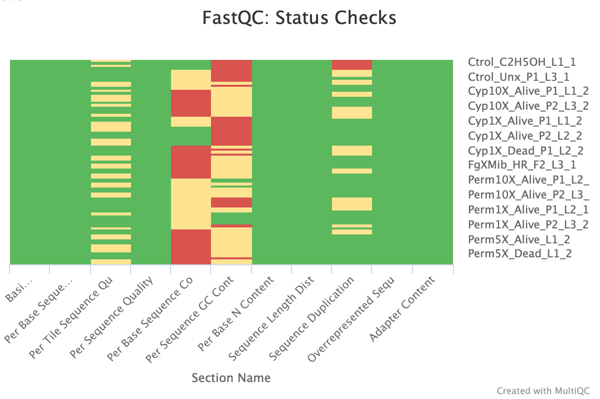

Contact: gadji.mahamat@crid-cam.net / gadji.mahamat@fasciences-uy1.cm / charles.wondji@crid-cam.net *

##### Hi there 👋 😁

I'm a PhD student in Cameroon.
I'm currently working on multiOMICs data to identify signatures of positive selection associated to resistance escalation in major malaria vectors.
Shell, python and R scripts below described the pipeline used for the analyses and visualization of the Poolseq GWAS data.

## [Features](#section-1)
OMIcsTouch is a computational pipeline base on shell, python and R script to analyse Illumina Whole Genome data of any organism and mainly Anopheles spp. It performs Poolseq and Metagenomic analyses including pairwise genetic differentiation among population, GWAS  Meta-taxomomy, differential abundance analysis, diversity analyses, selective sweeps analyses, variant calling and annotation. The workflow can perform these analyses on illumina paired-end PoolSeq data. This pipeline combines several Bioinformatics tools available in various repository. Because, it has automated scripts, it allows non Bioinformaticians to easely analyse thier Omics data without needing to do a lot of trainings on Bioinformatics and it safes a lot of time as well.

## Table of Contents

### [Bioinformatics Tools](#section-2)
## I. [Poolseq Genome-wide Association Study (Poolseq_GWAS) analysis pipeline](#section-3)
1. #### [Quality Control combining fastq and multiqc](#section-4)
2. #### [Alignment and statistics ](#section-5)
3. #### [Sorting and marking duplicates from .bam files](#section-6)
4. #### [Estimation of allele frequency](#section-7)
5. #### [Conversion of fractions into decimal numbers](#section-8)
6. #### [Population Genomic Analysis](#section-9)
7. #### [Detection of evidence of Selective Sweeps](#section-10)
8. #### [Variants calling and annotation](#section-11)

## II. [Metagenomic analysis pipeline](#section-12)
1. #### [Extraction of unmapped reads for Metagenomic analyses (EUMA)](#section-13)
2. #### [Generation of forward and reverse reads (R1 and R2) from a paired fastq file](#section-14)
3. #### [Metagemome Assembly and ORF prediction](#section-15)
4. #### [Microbial Classification using unmapped reads via Kraken2 (MCUUR)](#section-16)
5. #### [Converting fastq to fasta files](#section-17)
6. #### [Extraction of candidate bacteria taxa](#section-18)
7. #### [Microbial diversity analysis](#section-19)
8. #### [Microbial differential abundance analysis](#section-20)
9. #### [Microbial functional profiling](#section-21)

## Bioinformatics Tools

Below are the tools and versions used during the MultiOMICs analyses on a server.

- FastQC
- MultiQC
- BWA 0.7.17-r1188
- bowtie2
- Samtools 1.13
- Bedtools v2.30.0
- PoPoolation 2 v1201
- poolfstat
- Picard tool
- grenedalf
- freebayes v1.3.6
- awk 5.1.0
- SnpEff 5.1d
- WindowScanR
- R 4.2.3
- Kraken2 database
- Chocophlan, metaphlan and HumanN-3.6 databases
- Uniref database
- MEGAHIT v1.2.9
- TransDecoder-TransDecoder-v5.7.1
- ncbi-blast-2.14.1+
- DEseq2, EdgeR
- ANCOMBC
- Phyloseq

# I. [Poolseq Genome-wide Association Study (Poolseq_GWAS) analysis pipeline](#section-3)

## 1. Quality control script using fastqc and multiqc

I am going to show here how to use the `Fastq_Quality_check.sh` script i wrote to sequentialy perform quality control of your NGS data using `fastqc` then pipe the sdout from `fastqc` into `multiqc` to aggregate the results and visualize. This command helps you to save more time and speed your analyses.
Before to start please ensure that you make the script executable using the following command `chmod +x Fastq_Quality_check.sh`.

To to that,
- invoke `Fastq_Quality_check.sh` then run this command:
  
`./Fast_Quality_check.sh -i path/to/the/folder/containing/FastQ_files -o path/to/the/output_file -t 20`

Where,
- -i represents the path to the folder where all your fastQ files are located;
- -o represents the path to the file where you want to save your results (note that if it doesn't exist, it will be automatically created);
- -t is the number of thread you want to run your job with (you can adjust according to the performance and parameters of your computer).

After the quality control done you will have in the multiqc file a html document summarizing the QC for all your samples (see example below).

Fig 1. Quality control of Poolseq FASTQ data. Green, yellow, and red boxes represent pass, warn, and fail qualities, respectively.

  
## 2. Alignment and statistics

The `Alignment.sh` script was written to help align samples that have 2 or more read pairs (two or more reads for forward and for reverse reads post pair-end WGS). The alignment uses `bwa mem` algorith to perform alignment and convert the sam output into bam output using samtools.
In details,
- It check the number of forward and reverse reads for each sample.
- If a sample has exactly one pair of forward and reverse reads, the standart aligment usin BWA-MEM will be run;
- If a sample has two, three, or four pairs of forward and reverse reads, it will combine all the forward reads and all the reverse reads into two separate files and then run the BWA-MEM alignment on the combined reads;
- After the alignment is complete, the combined read files will be clean;
- If a sample doesn't have the correct number of reads, a message indicating that the sample is skipped will be print.
- 
How to run the command?
- invoke `Alignment.sh`

`./alignment.sh -b /path/to/base_dir -t 60 -r /path/to/reference/genome.fasta -o /path/to/output_dir`

Where
- -b represents the base directory;
- -t is the number of threads to use for the alignment;
- -r refers to the reference genome, note that it must be indexed before running (`bwa index genome.fasta`);
- -o refers to the sorted bam output file.

### Computing mapping and coverage statistics

Here, i will show you how to quickly compute mapping and coverage statistics using picard tools and samtools. This part will use `Mapping_statistics.sh` and `Coverage_statistics.sh` shell scripts.
How to run the command line for mapping statistics?

`./Mapping_statistics.sh -b path/to/the/bam_files/directory -o path/to/the/output_directory -p /path/to/the/picard/Software/directory/ -r /path/to/the/reference/VectorBase-61_AfunestusFUMOZ_Genome.fasta`

Where,
- -b represents the file in which the aligned bam files are located;
- -o represents the file in which the output will be redirected (it will be created if it doesn't exist);
- -p represents the directory in which the picard.jar is located;
- -r represents the path to the reference genome of the organism of interest.

How to run the command line for coverage statistics ?

`./Coverage_statistics.sh -b /path/to/bam_directory -o /path/to/output_directory`

### Note: It's important to do QC check pre and post Mapping your Reads to the reference.

## 3. Sorting and marking duplicates from .bam files

Here, i will show you how to sort according to coordinates, mark and remove duplicates using picard tools with bam files as input.
This session will use the shell script `Sorting_marking_duplicates.sh`.

How to run the command line?

`./Sorting_marking_duplicates.sh -i /path/to/input_dir -o /path/to/output_dir -m metrics.txt -p /path/to/picard.jar`

Where,
- -i represents the file in which the bam files to process are into;
- -o represents the file in which the output will be redirected;
- -m represents the file in which the metric files of each bam file will be save after marking duplicates;
- -p represents the path to the tool you will use to process the sorting and deduplication (in this case, picard.jar from the Picard toold).

Where,
-  -b represents the bam files directory;
-  -o represents the output directory (it will be automatically created if it doesn't exist).

### Creation of mpileup and synchronized file
Here, we are going to create mpileup file with final bam files as input then subsequently generate a synchronized file for input in Popoolation2.
Synchronized files basically contain the allele frequencies for every population at every base in the reference genome in a concise format. Note that the synchronized file format contains the allele frequencies after filtering for base quality (see `Kofler et al., 2011`).

For that, we need first to run:
`samtools mpileup -B -Q 0 -f /path/to/reference/genome/ /path/to/bam/files/s1.bam /path/to/bam/files/s2.bam /path/to/bam/files/sn.bam > /path/to/output/files/s1_s2_sn.mpileup`

Or alternatively, you can use the script i wrote `bam2mpileup.sh` to generate the mpileup file.

`./bam2mpileup.sh -r /path/to/reference/genome/reference.fa -o /path/to/output/files -p combined /path/to/bam/files/s1.bam /path/to/bam/files/s2.bam /path/to/bam/files/sn.bam`

Where,
- -r represents the indexed reference genome;
- -o represents the output file where the mpileup file will be stored (it is created automatically if it doesn't exist);
- -p represents the path to the bam files.

To generate synchronized file, we'll use this command from popoolation2 tutorial [popoolation2](https://sourceforge.net/p/popoolation2/wiki/Tutorial/).

`java -ea -Xmx7g -jar <popoolation2-path>/mpileup2sync.jar --input combined.mpileup --output combined_java.sync --fastq-type sanger --min-qual 10 --threads 20`

## 4. Estimation of allele frequency

### Conversion of fractions into decimal numbers

I wrote a shell script that can allow anyone to convert fractions into decimal numbers for downstream analyses. In my case, i was mainly interested on Major Allele (MAA) and Minor Allele (MIA) frequencies from the PoolSeq GWAS generated using Popoolation2.

How to run the command?
- Invoke `convert_fractions.sh` script for the job.

  
`./convert_fractions.sh -i path/to/the/input/file/input.txt -o path/to/the/input/file/output.txt -c ""`

Where
- -i defined the input file
- -o defined the output file
- -c defined the columns to process separated by space (eg. "5 8 10" for conversion of column 5, column 8 and column 10).

## 5. Population Genomic Analysis

The aim of this part is to detect regions of genomic/genetic differentiation across the genome of several populations (in our case Anopheles populations). For that, we are going to estimate pairwise FST genetic differentiation values using a custom script (`Fst_Sliding_windows.sh`) we wrote to facilitate windows analyses and base on [popoolation2](https://sourceforge.net/p/popoolation2/wiki/Tutorial/). It computes pairwise FST values across specified window and step sizes, with results saved according to individual window in unique output file. Informative progress messages ensure user guidance. This tool automates FST calculations, making it accessible and efficient for population genetics research, providing flexibility in parameter configurations and simplifying complex genetic analyses.

How to run the command ?
Invoke, Fst_sliding_windows.sh and run:

`./Fst_sliding_windows.sh -i path/to/sync/file.sync -o path/to/output -c 2 -C 10 -f "5%" -w "500,1000,2000" -s "250,500,1000" -p 40 -P "/mnt/46TB/Ghost/Space_Gadji/PoolSeq_2022/software/popoolation2_1201/" -F 0.2`

Where,

- -i represents the input sync file, (Please double-check that the path to the sync file is correct, and the file exists at that location);

- -o represents the output directory where the results will be stored (If it doesn't exist, it will be automatically created);

- -c represents the minimum count of alleles required to consider a site in the analysis (It should be a valid value);

- -C represents the minimum coverage required for a site to be included in the analysis, (Make sure it's a valid value and appropriate for your data);

- -f represents the maximum coverage as a percentage or a value of the total coverage;
The maximum coverage; All populations are required to have coverages, lower or equal than the maximum coverage;
The maximum coverage may be provided as one of the following:

         500 a maximum coverage of 500 will be used for all populations
         300,400,500 a maximum coverage of 300 will be used for the first population, a maximum coverage of 400 for the second population and so on
         5% the 5% highest coverages will be ignored, this value is independently estimated for every population

- -w represents a comma-separated list of window sizes, (ensure that the sizes are correctly formatted and separated by commas, eg. "500000,250000,100000");

- -s represents a comma-separated list of step sizes, (double-check the formatting and values, eg. "250000,125000,50000");

- -p  This sets the pool size of each sample paramete (the number of pools has to fit with the number of populations provided in the file);
-p 500 means that all populations have a pool size of 500
-p 500:300:600 means that the first population has a pool size of 500, the seccond of 300 and the third 600;

- -P represents the path to the Popoolation2 software;

- -F represents the min_covered_fraction value, (the minimum fraction of a window being between min-coverage and
        max-coverage in ALL populations);

Alternatively, you can run the Fst calculation for each locus and use [WindowScanR](https://github.com/tavareshugo/WindowScanR) in R platform for Windows analyses.
When the Job is done, please run this command line to covert and format the fst files into readeable file by R for plotting.

`perl path/to/popoolation2_1201/export/pwc2igv.pl --input path/to/fst/files --output path/to/output/`

## 6. Detection of evidence of Selective Sweeps

The aim of this section is to learn how to detect evidence of positive selection among different populations. For that, we are going to estimate Tajima's D parameter which could tell us about the state of selection in populations then estimate as well the genetic diversity by the mean of theta pi and theta watterson. To facilitate the calculations, we wrote an automated script based on [grenedalf](https://github.com/lczech/grenedalf) that iterates through each BAM file, creates output directories, and runs grendalf with specified window sizes and strides. It organizes results in separate directories, making analysis efficient and organized. Users execute the script by providing necessary options, enabling streamlined genomic data analysis. The beauty of this script is that it could consecutively process different window sizes and strides, then store each output in his own file.
How to run the job?
invoke `diversity_measure.sh` and run:

`./scripts/diversity_measure.sh -p path/to/grenedalf -d path/to/bam/files/directory -w "25000 50000 250000 500000" -s "12500 25000 125000 250000" -o path/to/output/directory -M 5 -S 5 -Q intersection -q 2 -L 4 -C 10 -c 1000 -F all -f comma -m nan -z popoolation-corrected-tajimas-d -n 80 -t path/to/log/diversity.log -T sliding`

Where,

- -p represents the path to the grendalf executable (make sure you have install grenedalf);

- -d represents the directory containing input BAM files for genomic analysis.

- -w Defines window sizes (in base pairs) for analysis. For example, four window sizes could be provided: 25,000; 50,000; 250,000; and 500,000;

- -s defines window sliding strides (in base pairs) corresponding to the window sizes;

- -o represents the directory where the output of the analysis will be stored;

- -M represents the minimum mapping quality threshold for reads in the BAM files to be included in the analysis;

- -S represents the minimum base quality threshold for reads to be included;

- -Q defines the method for selecting loci. could be "union" or "intersection";

- -q represents the minimum count of samples required for a locus to be included;

- -L represents the maximum count of samples allowed for a locus to be included;

- -C represents the minimum coverage depth required for a locus to be included;

- -c represents the maximum coverage depth allowed for a locus to be included;

- -F Defines the type of diversity measure to compute. It could be one of these measures {theta-pi,theta-watterson,tajimas-d}=all or "all," which likely means computing all available diversity measures;

- -f  Specifies the separator character used in output files, it could be one of these {comma,tab,space,semicolon}, its used comma by default; 

- -m Sets the value used for missing data entries in the output, (e.g., resulting from positions with no counts, or windows with no variants). This is useful to match formatting expectations of downstream software;

- -z Specifies an option or value for the analysis, related to Tajima's D calculations (popoolation-corrected-tajimas-d);

- -n Specifies the number of threads or CPU cores to be used for parallel processing;

- -t specifies the path for the log file where information about the analysis progress will be recorded.

- -T specifies the type of window to use for analysis, it could be on of these (sliding,queue,single,regions,chromosomes,genome);

## 7. Variants calling and annotation

# II. [Metagenomic analysis pipeline](#section-1)

## 1. Extraction of unmapped reads for Metagenomic analyses (EUMA)

I am going to show you how to perform metagenomic analyses using unmapped reads from WGS with the aim to identify microbial signature that could be potentially associated to insecticide super-resistance in malaria vectors.
During the WGS of malaria vectors, beside the entire genome that will be sequenced, other organisms genomes present in the sample are also sequenced. This involved bacteria, parasites, Eukaryotes, Viruses, funga and even unknown organisms refer as `dark reads` that will need further investigation to discover new species using De Novo assembly for example.
We are going to use here the script `Extract_unmapped_reads.sh` to retrieve unmapped reads from bam files then convert them into fastq files.
How to run the command?
- invoke `Extract_unmapped_reads.sh` and run

`./Extract_unmaped.sh -i /path/to/input_directory -o /path/to/input_directory/Unmapped_reads -t 20`

Where
- -i represents the input directory containing all the bam files;
- -o represents the output directory where to store all the unmapped reads for each sample;
- -t represents the number of threads for parallel processing (it depend on your computer capacity).

## 2. Generation of forward and reverse reads (R1 and R2) from a paired fastq file

Here we are going to generate the forward and the reverse reads from a single paired fastq file using `Seqtk` which is a command-line tool for processing sequences in various file formats, such as FASTA and FASTQ. It is often used in bioinformatics and genomics research for tasks like subsetting, converting between formats, and generating random sequences. Seqtk is a versatile and efficient tool that can be a valuable addition to your bioinformatics toolkit.
For that, we are going to use the `Separate_fastq_reads.sh` shell script with fastq files as input.
How to run the command ?
- invoke `Separate_fastq_reads.sh` and run

 `./Separate_fastq_reads.sh -i /path/to/input_directory -o /path/to/output_directory -t 10`

 Where
 - -i represents the input directory containing all the fastq files;
 - -o represents the output directory where to store all the forward (R1) and reverse (R2) for each sample;
 - -t represents the number of threads for parallel processing (it depend on your computer capacity).

## 3. Metagemome Assembly

Here we are going to generate contigs base on forward (R1) and reverse reads (R2) generated above. This is called assembly which involves reconstructing the complete DNA sequence of an organism's genome or a specific genomic region from short DNA fragments or reads. 
These reads are typically generated through DNA sequencing technologies. The assembly process aims to piece together these reads in the correct order and orientation to create a contiguous representation of the original DNA sequence. 
`MEGAHIT` will help us to do the job but we have render that very simple for none bioinformaticians by providing a bash script `assembly_script.sh` that could be run in just one single command line to process hunders of different samples.
This Bash script automates the assembly of paired-end sequencing data using `Megahit`. It supports both `.fastq` and `.fastq.gz` files. Users will just need to provide input and output directories, and optionally, the number of threads. 
It searches for paired-end files, creates output directories, and processes each sample separately. For each sample, it checks if the reverse read exists in either format, runs `Megahit` accordingly. The script is a versatile tool for batch processing paired-end sequencing data, ensuring compatibility with compressed and uncompressed formats while handling missing reverse reads.

How to run the script ?
Invoke `assembly_script.sh` and run:

`./assembly_script.sh -i Path/to/fastq/files/ -o Path/to/the/output/directory/ -t 10`

Where
- -i represents the input directory containing the fastq files;
- -o represents the output directory where to stored the assembled contigs in fasta format (note that if it doesn't exist, it will be automatically created);
- -t represents the number of threads for parallel processing (it depend on your computer capacity).

## 4. Microbial Classification using unmapped reads via Kraken2 (MCUUR)

Here, i am going to show you how to assess the microbial contribution in our sample.
To remind, what i did was to remove host genome (Anopheles funestus) by mapping to the AfunF3 genome avalaible on vectorbase.org then now i'm going to use the non-host reads to characterize microbial composition.
For this job, i'm going to use `kraken2` which is a taxonomic sequence classifier that assigns taxonomic labels to DNA sequences. Kraken examines the k-mers within a query sequence and uses the information within those k-mers to query a database. That database maps k-mers to the lowest common ancestor (LCA) of all genomes known to contain a given k-mer. To run the classification, you need to download the kraken2 database or build it in your computer.
A Kraken 2 database is a directory containing at least 3 files:

- `hash.k2d`: Contains the minimizer to taxon mappings;
- `opts.k2d`: Contains information about the options used to build the database; 
- `taxo.k2d`: Contains taxonomy information used to build the database.

Once you have the database to which you will classify your reads, you can:
- invoke `Kraken2_classification.sh` and run

`./Kraken2_classification.sh -i /path/to/fastq_directory -d /path/to/kraken_database -o /path/to/output_directory -u /path/to/unclassified_directory -c /path/to/classified_directory -t 50`

Where
- -i represents the input directory containing paired fastq files;
- -d represents the kraken2 database to which you want to classify your reads;
- -o represents the output directory where the classification reports will be stored (The directory is created automatically if it doesn't exist);
- -u represents the directory where the unclassified sequences will be stored (The directory is created automatically if it doesn't exist);
- -c represents the directory where the classified sequences will be stored (The directory is created automatically if it doesn't exist);
- -t represents the number of threads to use for parallel processing (it depends of your computer capacity).

## 5. Converting fastq to fasta files

Here i'll show how to convert fastq files into fasta files for downstream analyses like phylogenetic analysis. 
We are going to use the `fastq2fasta_file.sh` script here. The conversion is done via `awk` which is a versatile and powerful text-processing tool commonly used in Unix-like operating systems. 
It is primarily used for searching, extracting, and manipulating text data within files, making it a popular choice for tasks like data transformation, data analysis, and report generation.
How to run the command?
- invoke `fastq2fasta_file.sh` and run

`./fastq2fasta_file.sh -i input_directory -o output_directory -t 10`

Where
- -i represents the input directory containing the fastq files;
- -o represents the output directory where the fasta files will be stored (The directory is created automatically if it doesn't exist);
- -t represents the number of threads to use for parallel processing (it depends of your computer capacity).

## 6. Extraction of candidate bacteria taxa

Here, i am going to show how to extract bacteria sequences of interest using a python3 script i wrote based on the taxid generated post-kraken2 classification.
What we want to do is to extract all the most abundant bacteria sequence reads in our various samples. Remember when we did microbial classification using the `Kraken2_classification.sh` script, we generated an output file containing classified sequences.
We are now going to extract the most abundant sequences of interest for subsequent analyses.
For that, we are going to use the `Extract_sequences_taxid.py` script.
How to run the command?
- invoke `Extract_sequences_taxid.py` and run

 `python3 Extract_sequences.py -i input.fasta -o output.fasta -l id_list.txt`

 Where
 - -i represents the input file in fasta format where sequences will be extracted based on list of taxid;
 - -o represents the output file containing the extracted sequences of interest;
 - -l represents the list of taxid of all the bacteria taxa to be extracted.

Alternatively, you can use this simple command line to extract sequences of interest.

`grep -A 1 "kraken:taxid|idnumber" your_input.fasta | grep -v "^--$" > extracted_sequences.fasta`

## 7. Microbial diversity analysis

## 8. Microbial differential abundance analysis

## 7. Microbial functional profiling

